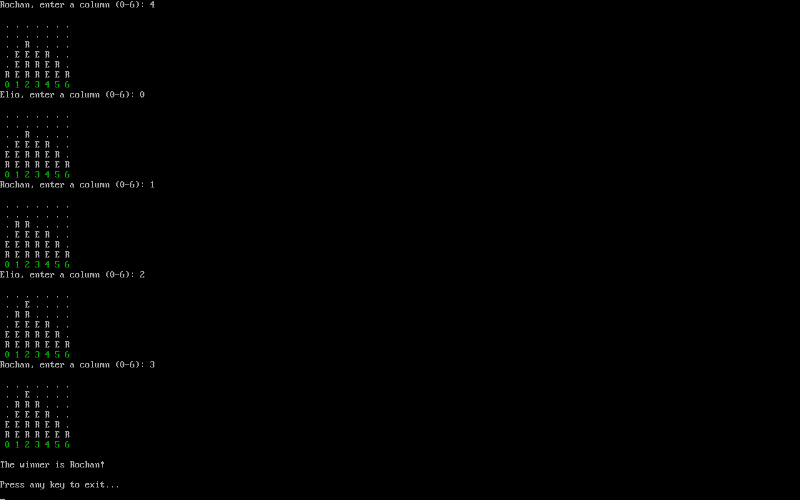
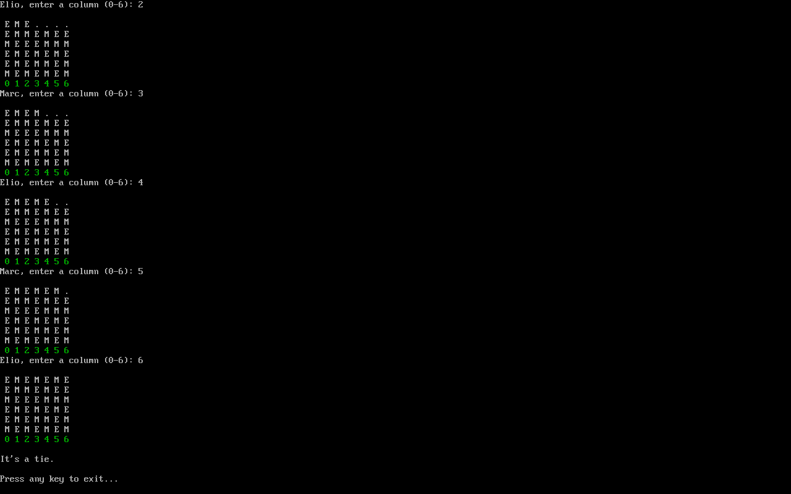
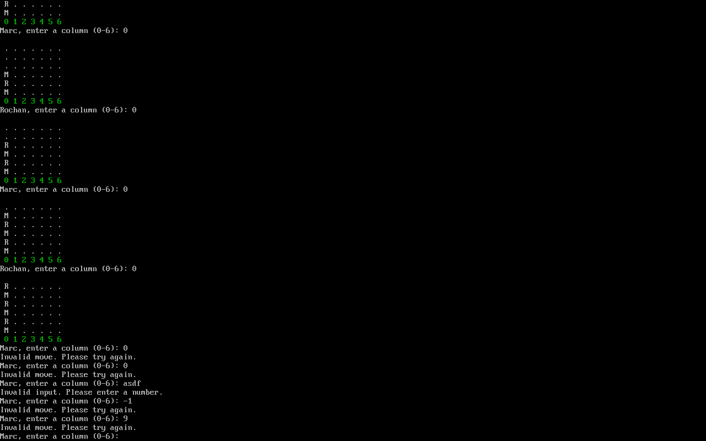

# Connect-4

**Team members:** Marc Hamamji, Elio Ishak, Rochan Sabek

## Table of Contents 
- [Description](#description)
- [Demo](#demo)
- [Requirements](#requirements)
- [Usage](#usage)
- [Setup on Alpine Linux](#setup-on-alpine-linux)
- [License](#license)

## Description
A console-based implementation of the classic **Connect Four** game in C. 
Two players (A and B) take turns dropping checkers into a 6x7 grid. 
The first player to connect four of their checkers horizontally, vertically, or diagonally wins.
If the grid fills up with no winner, the game ends in a tie.

This project is designed to run on **Linux**.

## Demo

### Case of a win


### Case of a tie


### Handling invalid input


## Requirements
This project needs `make` and `gcc` installed on your system.

## Usage
```sh
make # to compile

./main.out # to run
```

## Bot Complexity

### Easy Bot (Sprint 2)
The easy bot chooses a random valid column. This requires no search or evaluation.
Time Complexity: O(1)

### Medium Bot (Sprint 3)
The medium bot uses a minimax search algorithm with a fixed depth.
Branching factor in Connect 4 = 7 possible moves per turn.
Time Complexity: O(7^d)  (in our implementation: depth = 7, so worst case O(7^7))

### 🚧 Hard Bot (Sprint 4) 🚧
Under Construction.
Will include optimization and pruning to reduce the explored search space.


## Setup on Alpine Linux
1. Download the Apline Linux ISO.
2. Create a virtual machine using this ISO.
3. Run `setup-alpine` to install Alpine Linux on the virtual machine.
4. Remove the ISO and reboot the virtual machine.
5. Run `apk update` to update the repositories.
6. Run `apk add git make build-base` to install git, make, and gcc.
7. Run `git clone https://github.com/AUB-Tri-4ce/Connect-4` to clone the repo.
8. Run `cd Connect-4` to enter the project directory.
9. Compile the project using `make`.
10. In the file `/etc/inittab`, replace the line 
    ```
    tty1::respawn:/sbin/getty 38400 tty1
    ```
    by
    ```
    tty1::respawn:/root/Connect-4/main.out
    ```
11. Reboot the virtual machine and the game starts automatically.

## License
Licensed under the [GPL license](./LICENSE).


